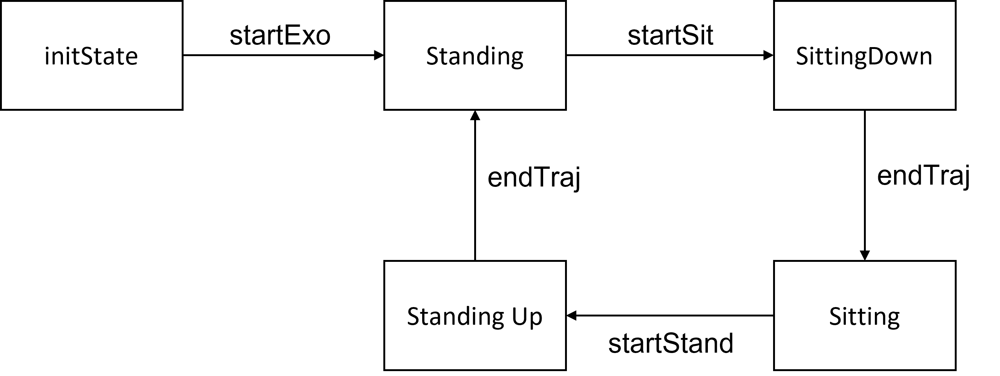

# Basic Simulation - Exoskeleton

The following instructions detail the building and testing of a simple test state machine for the X2 Exoskeleton (ExoTestMachine.cpp). This state machine  simulates a simple exoskeleton which can move between sitting and standing postures, running in position control, triggered by keyboard events. 

At the end of these instructions, you should be to compile and run this example CORC application, verifying that all development tools have been installed correctly. 

## Program Overview 
This example produces a simple state machine with 5 states, representing an exoskeleton which moves between sitting and standing states:



As can be seen in the state diagram, the program begins in the initState, requiring the startExo transition to the standing state (that is, the state representing the exoskeleton in a standing posture). From there, a startSitting event is required to transition to the SittingDown state (i.e. a state in which a trajectory representing a sitting down motion is executed), which ends with the EndTraj event and a transition to the Sitting state. From there, a similar startStanding event triggers a transition to the StandingUp state, which transitions back to the Standing state with an EndTraj event. 

This example will produce CAN messages on a virtual CANbus, which you can monitor and view. It will also produce text in a terminal window, with keybaord presses used to navigate between the states. 

## Installation Instructions

These instructions assume that you have a suitable development machine and a suitable deployment machine --- see (GettingStarted.md). It is suggested that the machines you use for his guide are the platforms you intend to develop on for your own application.

#### Development Machine Setup {#devsetup}
The development machine is the machine on which you write and compile the code. This is generally a machine running a desktop operating system, and can be either a Windows or Linux machine --- setup instructions for each can be found below:

- [Windows Workbench Setup](InstallWindows.md) - Instructions specific to  are tagged with **[DEV-WINDOWS]** 
- [Linux Workbench Setup](InstallLinux.md)

#### Deployment Machine Setup {#deploysetup}
The deployment machine is the computer which is runs the compiled code. This can be either a desktop computer running Linux (or even your development computer if you are running Linux), or an embedded computer. 

**[DEPLOY-LOCAL]** If your deployment machine is your Linux-based development machine, no additional setup is necessary. Please note that from this point, instructions specific to this setup are tagged with **[DEPLOY-LOCAL]**.

**[DEPLOY-REMOTE]** If you wish to run an embedded machine, the CORC development team primarily developed and tested on [Beaglebones](https://beagleboard.org/bone), and thus recommend this platform. Specifically, CORC has been most tested on a BeagleBone Black running Debian Stretch 9.5 [Firmware](http://beagleboard.org/latest-images). Instructions for setting up the Beaglebone Black can be found on [here](http://beagleboard.org/getting-started) on the Beaglebone Website.

> Note: if you use a Beagle Bone AI see instructions [here](../2.Hardware/BBAISetup.md) to setup the CAN device.

### Getting the Project
On your development computer, clone the project from git repository. You can do this using the command line by first navigating to an appropriate folder, and typing the command:
```bash
$ git clone --recursive -j8 https://github.com/UniMelbHumanRoboticsLab/CANOpenRobotController
```
**[DEV-WINDOWS]** Alternatively, if you are using Github Desktop for Windows, go to `File` -> `Clone Repository...`, enter `UniMelbHumanRoboticsLab/CANOpenRobotController` and select an appropriate folder to place your files. 

This repository includes all the sources files required for this example.

> Note: the `--recursive option` is required as external libraries (Eigen, spdlog...) are installed as git submodule (directly from their own repository).

### Building ExoTestMachine
CMake is used to generate an appropriate makefile for CORC framework. By default, the generated makefile is configured to compile an executable `ExoTestMachine_APP` using the default C/C++ compilers. 

**[DEPLOY-REMOTE]** To generate a cross-compiled executable (suitable for running on a Beaglebone Black) use the following commands on the host:
```bash
$ mkdir build
$ cd build
$ cmake -DCMAKE_TOOLCHAIN_FILE=../armhf.cmake ..
$ make
```
**[DEV-WINDOWS]** If running on Windows, you will also need to add the `-G "Unix Makefiles"` flag to the `cmake` command (i.e. `cmake -G "Unix Makefiles" -DCMAKE_TOOLCHAIN_FILE=../armhf.cmake ..`). This forces the Unix Makefile format, rather than the default `nmake` behaviour on Windows. 


[DEPLOY-REMOTE]
: To generate a cross-compiled executable (suitable for running on a Beaglebone Black) use the following commands on the host:
```bash
$ mkdir build
$ cd build
$ cmake -DCMAKE_TOOLCHAIN_FILE=../armhf.cmake ..
$ make
```
[DEV-WINDOWS]
: If running on Windows, you will also need to add the `-G "Unix Makefiles"` flag to the `cmake` command (i.e. `cmake -G "Unix Makefiles" -DCMAKE_TOOLCHAIN_FILE=../armhf.cmake ..`). This forces the Unix Makefile format, rather than the default `nmake` behaviour on Windows. 


You can alternatively shorten everything to a single line:
```bash
$ mkdir build && cd build/ && cmake -DCMAKE_TOOLCHAIN_FILE=../armhf.cmake ..
```
> Note that this requires an appropriately configured toolchain (`arm-linux-gnueabihf-` toolchain). See [Development Machine Setup](##devsetup) to setup an appropriate workbench if required.

**[DEPLOY-LOCAL]** If you are intending to execute the application on your (Linux) development computer, you can remove the `-DCMAKE_TOOLCHAIN_FILE=../armhf.cmake` alltogether (i.e. just run `cmake ..`). This will use the default C++ compilers on your Linux distribution.

### Transferring files to the Deployment Machine
**[DEPLOY-LOCAL]** This entire step is not required if you are running on your development machine - just note the location of your `ExoTestMachine_APP` and `script` folder. 

**[DEPLOY-REMOTE]** If you are deploying to a remote machine, you will need to transfer the compiled executable to the deployment machine. If you are using a BeagleBone, the recommended method of transferring files is FTP.

Using an FTP Client on the Host (if you do not have one - or a preferred client, [FileZilla](https://filezilla-project.org/) is reasonable), connect to the target (the BeagleBone). By default, when the BeagleBone is connected to a computer using USB, it is configured to:

> **IP Address:** 192.168.7.2 (Windows) or 192.168.6.2 (OSX and Linux)
> **Username:** debian
> **Password:** temppwd

On the host, using the FTP client, transfer the build executable in `build/ExoTestMachine_APP`, along with the contents of the `script` folder, to the Beaglebone.

Alternatively, you can use the [script/uploadBB.sh](../../script/uploadBB.sh) to automatically upload the content of the script folder and the build/\*APP to the BeagleBone through ssh. 

> Note: The `script` folder contains scripts for setting up the CAN interfaces that CORC uses for communication. In case you use a PEAK CAN USB device, make sure to either use the `initPCAN` script or to manually setup the CAN queue length to 1000 (`ifconfig can0 txqueuelen 1000`).

In addition, copy the `config` folder to the same directory as the executable - this is used to set some parameters in the X2Robot. 


## Run Virtual ExoTestMachine

### Connect to the Target and Modify Run Permissions
**[DEPLOY-REMOTE]**  To run the ExoTestMachine, open your preferred terminal window and SSH into the the BeagleBone. This will provide terminal access to the target, on the host. This can be done using the same username and password, e.g:
```bash
$ ssh debian@192.168.7.2
```

At this point, you will need to change the permissions of the executables to allow execution. You can do this using the the `chmod +x` command on the target. e.g.

```bash
$ chmod +x ExoTestMachine_APP
```
This must be repeated for the `.sh` scripts as well.

**[DEPLOY-LOCAL]**  If you are deploying to a local machine, these steps are not required are not required, you will just need to open a terminal window for the next steps.
-----CHECK IF YOU NEED TO CHANGE PERMISSIONS ON LINUX -----

### Initialise Virtual CAN Device
The CORC Application requires the a CAN device to send commands to. For this test, we create a virtual CAN device (so no hardware is required). To do this, initialise the Virtual CAN device to set up, bind to and run candump ([candump manpage](https://manpages.debian.org/testing/can-utils/candump.1.en.html)) on the VCAN interface using the `initVCAN` script. 

```bash
$  cd script
$  ./initVCAN.sh
```
This initialises a virtual CAN interface, and prints the contents of the bus to the terminal window.

> Note: This can be changed to use a non-virtual CAN interface, but this requires some minor changes to the code before compilation, and the use of the `initCAN0.sh` script (or `initPCAN.sh` if you use a PEAK CAN USB device) instead.

SSH into the BeagleBone in a second terminal window (**[DEPLOY-LOCAL]** or launch a second terminal) to launch the application:

```bash
$  cd build
$  sudo ./ExoTestMachine_APP
```

> Note: Superuser privileges (`sudo`) are required due to the use of real time threads in the application.

The first terminal one should display CAN messages on VCAN from the `EXOTestMachine_APP` application output. On startup init PDO messaging should be sent and appear as follows:
​

```bash
vcan0 704 [1] 00
vcan0 184 [2] 00 00 # PDO message
vcan0 704 [1] 05
```

​
Follow terminal instructions using your keyboard in the second terminal instance to run through test stateMachine.​

```bash
==================================
 WELCOME TO THE TEST STATE MACHINE
==================================
==================================
 PRESS S to start program
==================================
​
```

The first terminal instance (running candump) should display PDO messages corresponding to changes to the commanded motor positions as follows:

```bash
vcan0  301   [8]  2F 60 60 00 00 00 00 00
vcan0  302   [8]  80 60 60 00 00 00 00 00
vcan0  303   [8]  2F 60 60 00 00 00 00 00
vcan0  304   [8]  80 60 60 00 00 00 00 00
```

> Note these TPDO messages are configured in the Object Dictionary, with configuration SDOs to be sent during the Robot Initialisation stage. Details for the default set of PDOs can be found in the drive.h source files.

As the simulated device is in position control, these messages should print whenever the system moves from sit to stand or stand to sit, with no messages transmitted whilst the device is stationary (except for the SYNC messages of the format `vcan0 080 [0]`). CORC has provisions for velocity and torque control, but these are not included in this example for ease of simulation.

If these messages are present, this indicates that the workbench and CORC toolbox have been installed successfully. You can close the program by pressing `ctrl+c`.

​<!-- ## Run ExoTestMachine on X2
Running on the X2 Robot is very similar to the virutal CAN set up, with one adjustment and -->
<!-- ### TODO: Event Driven State machine
explain me -->